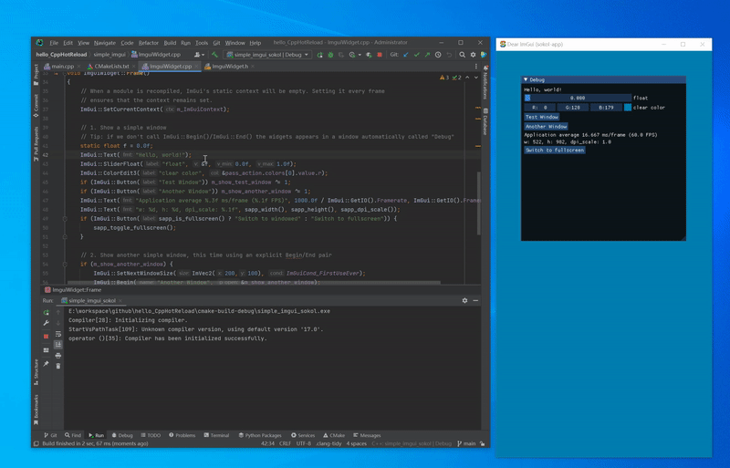

# hello_CppHotReload

CppHotReload using [hscpp](https://github.com/jheruty/hscpp)

# How to use hscpp

- [hscpp docs](https://github.com/jheruty/hscpp/blob/master/docs/README.md)
- [hscpp toturial](https://github.com/jheruty/hscpp/blob/master/docs/2_hotswapper-basics.md)

# Other C/C++ HotReload lib/framework
- 
- [blink](https://github.com/crosire/blink)
- [RuntimeCompiledCPlusPlus](https://github.com/RuntimeCompiledCPlusPlus/RuntimeCompiledCPlusPlus)
- [cr](https://github.com/fungos/cr)
